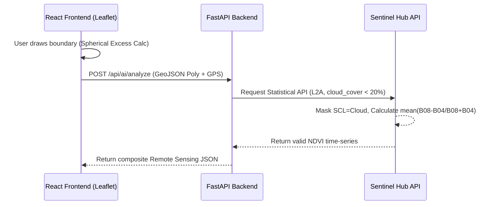

# 🛰️ Document 1: Theoretical & Practical Foundations of Satellite Remote Sensing & GIS Telemetry

---

## 📌 Executive Overview
This document provides a deep, theoretical dive into the Satellite Remote Sensing and Geographic Information System (GIS) engine integrated into **KisanAI**. It explores the physics of electromagnetic radiation, the operational mechanics of the Sentinel-2 constellation, the mathematics of geodesic area computation, and the practical implementation of these concepts in our cloud-native architecture.

---

## 1. 🔍 Deep Dive: WHAT Are We Using?

### 1.1 The Sentinel-2 Copernicus Constellation
KisanAI relies on data from the European Space Agency's (ESA) Copernicus program, specifically the **Sentinel-2 L2A** mission. 
- **L2A (Level-2A)**: This signifies that the data has undergone **Atmospheric Correction**. Raw satellite imagery (Level-1C) contains atmospheric scattering (aerosols, water vapor, Rayleigh scattering). Level-2A utilizes the *Sen2Cor* processor to convert Top-Of-Atmosphere (TOA) reflectance to Bottom-Of-Atmosphere (BOA) reflectance. This is critical for agriculture, as it gives the true reflectance of the Earth's surface, removing atmospheric noise.
- **Multispectral Bands**: Sentinel-2 captures 13 spectral bands. We primarily utilize:
  - **Band 4 (Red)**: Central wavelength ~665 nm. Strongly absorbed by chlorophyll pigments in healthy plants.
  - **Band 8 (Near-Infrared - NIR)**: Central wavelength ~842 nm. Strongly reflected by the spongy mesophyll layer in plant leaves.

### 1.2 GIS Base Maps & Tile Services
- **Esri World Imagery**: We use Esri's REST tile services for visual base maps. This provides sub-meter resolution (often <1m) optical imagery, far superior for identifying field boundaries compared to standard mapping services.
- **Leaflet & React-Leaflet**: The frontend GIS rendering engine uses Web Mercator projection (EPSG:3857) to render map tiles and Vector layers (GeoJSON polygons) directly in the browser's DOM or Canvas.

---

## 2. ⚙️ Theoretical Mechanics: HOW Are We Using It?

### 2.1 The Physics of Vegetation Indices (NDVI)
The **Normalized Difference Vegetation Index (NDVI)** exploits the unique electromagnetic signature of living vegetation.
Healthy plants perform photosynthesis, which requires absorbing red and blue light. Simultaneously, the cellular structure of leaves scatters and reflects Near-Infrared (NIR) light to prevent the plant from overheating.

**Mathematical Formulation:**
$$\text{NDVI} = \frac{\text{Reflectance}_{\text{NIR}} - \text{Reflectance}_{\text{Red}}}{\text{Reflectance}_{\text{NIR}} + \text{Reflectance}_{\text{Red}}}$$

**Theoretical Boundaries:**
- The index is mathematically bounded: $-1 \leq \text{NDVI} \leq +1$.
- **Water/Clouds**: Negative values (NIR absorption > Red).
- **Bare Soil**: Values near $0.1$ to $0.2$ (NIR and Red reflectance are similar).
- **Dense Vegetation**: Values ranging from $0.6$ to $0.9$ (High NIR reflectance, massive Red absorption).

In KisanAI, the Sentinel Hub API applies cloud masks (`SCL` Scene Classification Layer) to ignore pixels obscured by clouds, averaging the NDVI of the remaining valid pixels within the farmer's drawn polygon.

### 2.2 The Mathematics of Geodesic Area (The Haversine & Spherical Excess)
Standard Euclidean geometry ($Area = length \times width$) fails on a global scale because the Earth is an oblate spheroid, not a flat plane.
To calculate the exact area of a farmer's drawn polygon, KisanAI utilizes spherical trigonometry.

Given a polygon defined by coordinates $(\lambda_1, \phi_1), (\lambda_2, \phi_2), \dots, (\lambda_n, \phi_n)$ where $\lambda$ is longitude and $\phi$ is latitude (in radians).

The area is derived using the concept of **Spherical Excess**, calculating the area of a spherical polygon based on the Earth's radius ($R \approx 6,378,137\text{ m}$):

$$\text{Area} = \frac{R^2}{4} \sum_{i=1}^{n} (\lambda_{i+1} - \lambda_i) (2 + \sin\phi_i + \sin\phi_{i+1})$$

This ensures that a 2.5 Hectare field drawn in Maharashtra is calculated with immense precision, accounting for planetary curvature, which is subsequently converted to local units (Bigha) and Hectares.

### 2.3 Data Pipeline Architecture (Visualized)

---

## 3. 🎯 Theoretical Rationale: WHY Are We Using It?

1. **Objectivity Over Subjectivity**: Agricultural lending historically relies on physical inspections, which are prone to human bias, corruption, and massive logistical overhead. Remote sensing introduces absolute mathematical objectivity. A bank cannot argue with a multi-spectral optical reflectance signature.
2. **Economic Scalability**: Esri World Imagery combined with open-source Leaflet mapping completely bypasses the exorbitant billing models of commercial mapping APIs (like Google Maps), scaling infinitely at near-zero marginal cost per farmer.
3. **Temporal Analysis Capabilities**: Satellite telemetry isn't just spatial; it's temporal. Sentinel-2 revisits the exact same coordinate every 5 days. This allows KisanAI to chart crop phenology (growth stages) over time, definitively proving a crop was sown, grew, and was harvested.

---

## 4. 📍 Implementation Map: WHERE Are We Using It?

| Component | Code Reference / File Path | Theoretical Application |
|---|---|---|
| **GIS Engine** | [`frontend/src/components/FarmlandMap.jsx`](file:///home/nuctan/Desktop/kisaanai/frontend/src/components/FarmlandMap.jsx) | Handles the Web Mercator projection, spherical excess calculation (`computePolygonAreaSqMeters`), and tile rendering. |
| **API Integration** | [`ml_service/ndvi_real.py`](file:///home/nuctan/Desktop/kisaanai/ml_service/ndvi_real.py) | Executes the OAuth2 flow to ESA Sentinel Hub, sending WGS84 bounding boxes for optical evaluation. |
| **Trend Analytics** | [`ml_service/trend_analytics.py`](file:///home/nuctan/Desktop/kisaanai/ml_service/trend_analytics.py) | Constructs the time-series arrays for phenological tracking across 12 months. |
| **Data Visualization**| [`frontend/src/components/SatelliteTrendChart.jsx`](file:///home/nuctan/Desktop/kisaanai/frontend/src/components/SatelliteTrendChart.jsx) | Plots the NDVI curve alongside precipitation data to visually prove the correlation between water input and vegetative output. |
