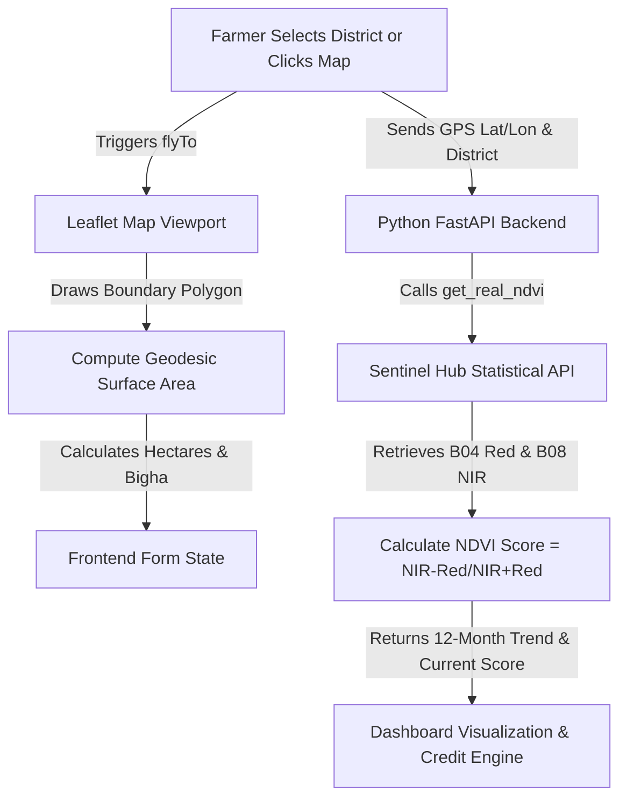

# 🛰️ Document 1: Satellite Remote Sensing & GIS Telemetry Engine

---

## 📌 Executive Overview
This document explains the Satellite Remote Sensing and Geographic Information System (GIS) engine integrated into **KisanAI**. It detail how orbital earth observation data is ingested, processed, and visualized to provide real-time and historical crop health analytics.

---

## 1. 🔍 WHAT Are We Using?

| Technology / Component | Type | Description |
|---|---|---|
| **Sentinel-2 L2A Satellite** | Earth Observation Satellite | European Space Agency (ESA) Copernicus Sentinel-2 constellation providing 10m multispectral resolution (NIR & Red bands). |
| **Sentinel Hub Statistical API** | REST / Python SDK | Sentinel Hub API v3 used for aggregated monthly NDVI queries over custom polygon geometries. |
| **Esri World Imagery** | GIS Tile Server | High-resolution satellite base map imagery provided by Esri ArcGIS (`ArcGIS/rest/services/World_Imagery`). |
| **Leaflet & React-Leaflet** | Interactive GIS Library | Open-source JavaScript GIS library for rendering interactive maps, custom polygon drawing, and animated map pan. |
| **Geodesic Haversine Formula** | Mathematical Algorithm | Spherical geometry formula calculating exact farmland surface area in Hectares, Bigha, and Square Meters. |

---

## 2. ⚙️ HOW Are We Using It?

### 🔄 Data Pipeline Architecture

### 🧮 1. Mathematical Formulas Used

#### A. Normalized Difference Vegetation Index (NDVI)
$$\text{NDVI} = \frac{\text{NIR (Band 8)} - \text{Red (Band 4)}}{\text{NIR (Band 8)} + \text{Red (Band 4)}}$$
- **NDVI > 0.65**: Dense, healthy green crop (Optimal)
- **0.40 ≤ NDVI < 0.65**: Moderate vegetation
- **NDVI < 0.40**: Crop stress / bare land / post-harvest

#### B. Geodesic Polygon Area Calculation
$$\text{Area} = \frac{R^2}{4} \sum_{i=1}^{n} (\lambda_{i+1} - \lambda_i) (2 + \sin\phi_i + \sin\phi_{i+1})$$
Where $\lambda$ is longitude in radians, $\phi$ is latitude in radians, and $R = 6,378,137\text{ meters}$.

---

## 3. 🎯 WHY Are We Using It?

1. **Zero Field Visit Requirement for Banks**: Financial institutions can verify whether a crop is actually growing on the land remotely without sending field agents.
2. **100% Free Base Maps**: Using Esri World Imagery + Leaflet avoids costly Google Maps API billing quotas ($200/month limit).
3. **Automated Land Measurement**: Farmers do not need to manually guess field size — drawing a polygon on the satellite map automatically computes exact Hectares & local Bigha units.
4. **Cloud-Masked Historical Accuracy**: Sentinel Hub Statistical API automatically filters out cloud cover (`SCL` Scene Classification Layer) to extract true vegetation values.

---

## 4. 📍 WHERE Are We Using It?

| File Location | Function / Code Reference | Role |
|---|---|---|
| [`frontend/src/components/FarmlandMap.jsx`](file:///home/nuctan/Desktop/kisaanai/frontend/src/components/FarmlandMap.jsx) | `computePolygonAreaSqMeters()`, `FlyToLocation()` | Interactive satellite map, polygon drawing, flyTo animation, area calculation. |
| [`ml_service/ndvi_real.py`](file:///home/nuctan/Desktop/kisaanai/ml_service/ndvi_real.py) | `get_real_ndvi()` | Live Sentinel-2 L2A satellite API query for exact GPS coordinate. |
| [`ml_service/trend_analytics.py`](file:///home/nuctan/Desktop/kisaanai/ml_service/trend_analytics.py) | `_fetch_real_ndvi_12months()` | Sentinel Hub Statistical API batch call for 12-month district historical NDVI trends. |
| [`frontend/src/components/SatelliteTrendChart.jsx`](file:///home/nuctan/Desktop/kisaanai/frontend/src/components/SatelliteTrendChart.jsx) | `<SatelliteTrendChart />` | Dual-axis visual chart rendering NDVI curve overlay and Open-Meteo rainfall bars. |
