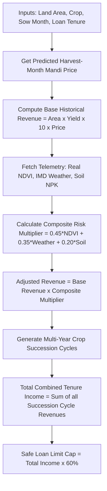

# 📈 Document 2: Agricultural Credit Scoring & MLOps Engine

---

## 📌 Executive Overview
This document details the **AI/ML Risk Scoring & Credit Eligibility Engine** powering **KisanAI**. It outlines how satellite vegetation metrics, IMD weather forecasts, regional soil N-P-K nutrient density, seasonal commodity price forecasting, and multi-year crop succession logic combine into a transparent 60% Safe Credit Cap for agricultural banking.

---

## 1. 🔍 WHAT Are We Using?

| Component / Model | Type | Description |
|---|---|---|
| **Composite Telemetry Risk Model** | Weighted ML Evaluation | Multi-variable weighted scoring algorithm evaluating Satellite NDVI (45%), IMD Climate (35%), and Soil NPK (20%). |
| **Seasonal Price Forecasting Model** | Time-Series Mandi Index | Seasonal commodity index predicting crop mandi price at **harvest month** rather than static historical averages. |
| **Multi-Year Crop Succession Engine** | Agronomic Decision Matrix | Multi-season crop rotation simulator projecting total combined farmer revenue across 1 to 5-year loan tenures. |
| **60% Safe Credit Limit Cap** | Banking Risk Algorithm | Financial safety rule limiting maximum loan eligibility to 60% of projected total multi-season revenue to prevent debt traps. |
| **IMD Weather API & Open-Meteo Archive** | Meteorological Services | Real-time weather and 12-month historical rainfall telemetry datasets. |

---

## 2. ⚙️ HOW Are We Using It?

### 🔄 Multi-Stage Credit Calculation Architecture

### 🧮 1. Detailed Mathematical Formulas

#### A. Base Revenue Formula
$$\text{Base Revenue (₹)} = \text{Area (Ha)} \times \text{Historical Yield (Tonnes/Ha)} \times 10 \times \text{Predicted Mandi Price (₹/Quintal)}$$

#### B. Telemetry Adjusted Revenue Formula
$$\text{Adjusted Revenue} = \text{Base Revenue} \times \left( 0.45 \cdot S_{\text{NDVI}} + 0.35 \cdot S_{\text{Weather}} + 0.20 \cdot S_{\text{Soil}} \right)$$

#### C. Seasonal Harvest Price Prediction
$$\text{Harvest Price} = \text{Historical Base Price} \times \text{Seasonal Index}\left[\text{Sow Month} + \text{Duration} \pmod{12}\right]$$
*Example:* Wheat sown in November ($\text{idx}=10$), 4-month duration $\rightarrow$ Harvest in March ($\text{idx}=2$). March Seasonal Index for Wheat $= 1.05\times$ (High demand period).

#### D. Safe Loan Cap Rule
$$\text{Maximum Approved Loan} = \text{Total Combined Tenure Income} \times 0.60$$

---

## 3. 🎯 WHY Are We Using It?

1. **Prevents Farmer Debt Traps**: Traditional banks lend based purely on land title value. KisanAI calculates loan caps based on **real repayment capability from future crop yields**, keeping debt under 60%.
2. **Realistic Market Dynamics**: Using static mandi prices gives false expectations. Predicting price at **harvest month** accurately mirrors seasonal market price fluctuations.
3. **Encourages Soil Health (Agronomic Rotations)**: The multi-year engine automatically recommends leguminous crops (e.g. Summer Mung Bean after Wheat) to replenish soil nitrogen naturally.
4. **Instant Transparent Calculation**: Farmers can see every step of the math in the `CalculationBreakdown` component, building trust.

---

## 4. 📍 WHERE Are We Using It?

| File Location | Function / Component Reference | Role |
|---|---|---|
| [`ml_service/data_loader.py`](file:///home/nuctan/Desktop/kisaanai/ml_service/data_loader.py) | `get_predicted_harvest_price()`, `get_historical_averages()` | Seasonal price multiplier logic, harvest month calculation, yield datasets. |
| [`ml_service/scoring.py`](file:///home/nuctan/Desktop/kisaanai/ml_service/scoring.py) | `calculate_adjusted_revenue()`, `get_ndvi_score()`, `get_soil_score()` | Telemetry risk weighting logic (45% / 35% / 20%). |
| [`ml_service/crop_recommendation.py`](file:///home/nuctan/Desktop/kisaanai/ml_service/crop_recommendation.py) | `get_multiyear_crop_succession_plan()` | Multi-year rotation timeline generator, agronomic rationale. |
| [`ml_service/main.py`](file:///home/nuctan/Desktop/kisaanai/ml_service/main.py) | `/api/ai/analyze`, `/api/predict-revenue` | Unified FastAPI endpoint executing credit workflow. |
| [`frontend/src/components/CalculationBreakdown.jsx`](file:///home/nuctan/Desktop/kisaanai/frontend/src/components/CalculationBreakdown.jsx) | `<CalculationBreakdown />` | UI breakdown card showing 4-step transparent math. |
| [`frontend/src/components/FullLandReport.jsx`](file:///home/nuctan/Desktop/kisaanai/frontend/src/components/FullLandReport.jsx) | `<FullLandReport />` | Multi-year succession timeline and next crop sowing decision card. |
