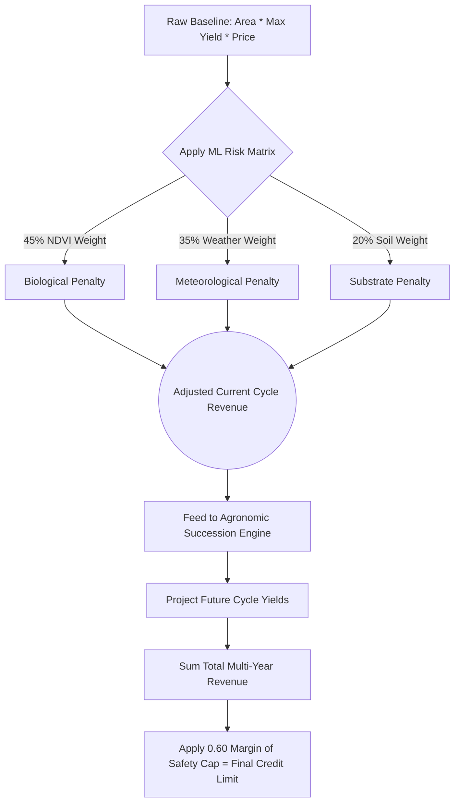

# 📈 Document 2: Theoretical Models of Agricultural Credit Scoring & MLOps

---

## 📌 Executive Overview
This document explores the mathematical algorithms and econometric theories underlying the **AI/ML Risk Scoring & Credit Eligibility Engine**. It details how the engine synthesizes deterministic telemetry (NDVI), probabilistic meteorology (IMD), agronomic succession, and time-series commodity forecasting into a rigorous **Debt Service Coverage Ratio (DSCR)** equivalent—safeguarding against rural debt traps.

---

## 1. 🔍 Deep Dive: WHAT Are We Using?

### 1.1 The Econometrics of Agricultural Lending
Traditional agricultural lending suffers from extreme Information Asymmetry. The lender knows little about the true yield potential or agronomic behavior of the borrower. KisanAI bridges this gap using a **Composite Telemetry Risk Model**. This model acts as a dynamic underwriting agent.

### 1.2 Time-Series Seasonal Commodity Forecasting
Mandi (wholesale market) prices are highly elastic and seasonal. Using historical flat averages (e.g., a static ₹2200/quintal for Wheat) mathematically misprices risk.
KisanAI employs a **Seasonal Price Forecasting Model**. It projects the exact commodity value at the time of *future harvest*, factoring in supply gluts (prices crash post-harvest) and off-season scarcity (prices peak).

### 1.3 Agronomic Soil Science Models
Monoculture (planting the same crop repeatedly) leads to catastrophic soil fatigue and nitrogen depletion. The **Multi-Year Crop Succession Engine** applies agronomic theory (specifically the role of leguminous crops like Mung Bean in nitrogen fixation) to project sustainable, multi-season yield trajectories.

---

## 2. ⚙️ Theoretical Mechanics: HOW Are We Using It?

### 2.1 The Mathematics of Risk Mitigation
The algorithm is designed to compute the *True Repayment Capacity* of the land, adjusting theoretical maximum yields downward based on real-world telemetry risks.

#### A. The Telemetry Risk Multiplier ($M_{\text{Risk}}$)
The engine applies a weighted linear combination of three environmental risk factors:
$$M_{\text{Risk}} = (w_1 \cdot \text{NDVI}_{\text{score}}) + (w_2 \cdot \text{Weather}_{\text{score}}) + (w_3 \cdot \text{Soil}_{\text{score}})$$
Where weights are assigned based on agronomic impact severity:
- $w_1 = 0.45$: Biological reality (NDVI). If the plant is dead, the loan defaults regardless of future weather.
- $w_2 = 0.35$: Meteorological risk (IMD). Droughts or floods decimate yield.
- $w_3 = 0.20$: Substrate quality (Soil N-P-K). Impacts overall vigor.

#### B. The Seasonal Price Matrix
If a farmer sows crop $C$ in month $t_{sow}$ with a biological duration of $d$ months, the harvest occurs at month $t_{harvest} = (t_{sow} + d) \pmod{12}$.
The predicted revenue is:
$$\text{Revenue} = \text{Yield} \times P_{\text{base}} \times I_{\text{seasonality}}(C, t_{harvest})$$
Where $I_{\text{seasonality}}$ is an econometrically derived index (e.g., $1.05$ indicating a 5% price premium in that specific month).

#### C. The 60% Safe Credit Cap (DSCR Equivalence)
In corporate finance, the Debt Service Coverage Ratio (DSCR) dictates loan safety. In agrarian economics, operating margins are thin (fertilizer, labor, machinery costs consume ~30-40% of revenue).
Therefore, KisanAI enforces a strict mathematical cap:
$$\text{Max Loan Exposure} \leq \sum_{i=1}^{\text{Cycles}} (\text{Revenue}_i) \times 0.60$$
By capping the loan at 60% of projected gross revenue, the engine ensures a built-in 40% margin of safety to absorb price shocks or yield drops, systematically preventing the cascading debt cycles prevalent in rural lending.

### 2.2 Algorithm Flow Architecture

---

## 3. 🎯 Theoretical Rationale: WHY Are We Using It?

1. **Systemic Debt Prevention**: The core thesis of KisanAI is that over-leveraging destroys agrarian economies. By mathematically enforcing a 40% safety margin and adjusting for real-time biological failure (via NDVI), the system fundamentally prevents a bank from issuing a loan the land cannot mathematically repay.
2. **Predictive Accuracy over Retrospective Averaging**: Using forward-looking harvest month pricing is theoretically superior to retrospective averaging, as it aligns debt repayment schedules with actual liquid cash inflows.
3. **Incentivizing Sustainable Farming**: By modeling multi-year successions that include nitrogen-fixing crops, the algorithm proves to banks that sustainable farming yields higher long-term financial stability, indirectly incentivizing better ecological practices through better loan terms.

---

## 4. 📍 Implementation Map: WHERE Are We Using It?

| Core Logic | Code Reference / File Path | Theoretical Application |
|---|---|---|
| **Seasonal Econometrics** | [`ml_service/data_loader.py`](file:///home/nuctan/Desktop/kisaanai/ml_service/data_loader.py) | Implementation of $t_{harvest}$ modulus math and application of the $I_{\text{seasonality}}$ matrix. |
| **Risk Weighting** | [`ml_service/scoring.py`](file:///home/nuctan/Desktop/kisaanai/ml_service/scoring.py) | Execution of the linear combination risk formula ($M_{\text{Risk}}$). |
| **Agronomic Matrices** | [`ml_service/crop_succession.py`](file:///home/nuctan/Desktop/kisaanai/ml_service/crop_succession.py) | Hardcoded biological truths regarding crop rotation and nitrogen fixation limits. |
| **DSCR Visualization** | [`frontend/src/components/CalculationBreakdown.jsx`](file:///home/nuctan/Desktop/kisaanai/frontend/src/components/CalculationBreakdown.jsx) | Transparent translation of the 60% cap formula for the end-user. |
