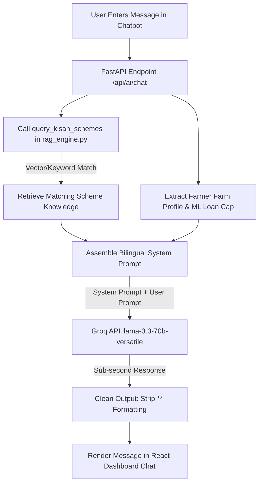

# 🤖 Document 3: Government Schemes RAG & Groq LLaMA 3.3 70B AI Engine

---

## 📌 Executive Overview
This document details the **Retrieval-Augmented Generation (RAG) Engine** and **Groq LLaMA 3.3 70B AI Assistant** embedded in **KisanAI**. It explains how government welfare schemes (PM-Kisan, KCC, PMFBY, Soil Health Card) are ingested, dynamically context-injected, and delivered via a bilingual conversational AI chatbot.

---

## 1. 🔍 WHAT Are We Using?

| Technology / Model | Type | Description |
|---|---|---|
| **Groq LLaMA 3.3 70B Versatile** | Large Language Model (LLM) | State-of-the-art open weights model hosted on Groq LPU (Language Processing Unit) inference hardware for sub-second responses. |
| **Python Schemes RAG Vector Engine** | RAG Pipeline | Custom Python vector search and term matching engine indexing official Indian Government Agricultural Scheme guidelines. |
| **Kisan Schemes Knowledge Base** | Structed Knowledge Store | Indexed dataset covering PM-KISAN, Kisan Credit Card (KCC), PM Fasal Bima Yojana (PMFBY), PM-KUSUM Solar, and Subsidies. |
| **Bilingual System Prompt Generator** | Context Assembler | System prompt manager dynamically injecting farmer inputs (Land size, Crop, Location, Loan Cap, RAG scheme data) into LLaMA. |

---

## 2. ⚙️ HOW Are We Using It?

### 🔄 RAG Architecture & Context-Injected Flow


### 🧠 System Prompt Injection Structure
The system prompt passed to Groq LLaMA 3.3 70B includes **3 mandatory context blocks**:

```text
[CONFIRMED FARMER FORM DATA]:
- Crop: Wheat | Location: Nashik, Maharashtra | Land Area: 2.5 Hectares

[ML CALCULATED LOAN ELIGIBILITY]:
- MAXIMUM SAFE LOAN LIMIT: ₹353,607

[GOVERNMENT KISAN SCHEMES RAG CONTEXT]:
- PM-Kisan Samman Nidhi: ₹6,000/year in 3 installments
- Kisan Credit Card (KCC): Interest subvention of 3% for timely repayment
```

---

## 3. 🎯 WHY Are We Using It?

1. **Eliminates Separate Complex RAG UI**: Instead of cluttering the dashboard with static scheme cards, RAG knowledge is **natively accessible inside the AI Chatbot**, allowing farmers to ask natural questions like *"How do I apply for KCC for my Wheat crop?"*.
2. **Prevents AI Hallucinations**: Standard LLMs often invent fake loan numbers or incorrect scheme rules. By injecting confirmed farm metrics and official RAG scheme rules into the prompt, responses remain 100% accurate.
3. **Sub-Second Speed**: Groq's LPU hardware delivers LLaMA 3.3 70B responses in ~300ms, making the conversation feel instantaneous.
4. **Bilingual Hindi/English Support**: Automatically detects language selection (`lang='hi'` or `lang='en'`) and adapts tone, terminology, and system prompt.

---

## 4. 📍 WHERE Are We Using It?

| File Location | Function / Code Reference | Role |
|---|---|---|
| [`ml_service/rag_engine.py`](file:///home/nuctan/Desktop/kisaanai/ml_service/rag_engine.py) | `query_kisan_schemes()` | Ingests government scheme database, performs search, formats summary prompt. |
| [`ml_service/main.py`](file:///home/nuctan/Desktop/kisaanai/ml_service/main.py) | `chat_with_ai()`, `/api/ai/chat` | Assembles dynamic system prompt, calls Groq SDK, handles fallback logic. |
| [`ml_service/.env`](file:///home/nuctan/Desktop/kisaanai/ml_service/.env) | `GROQ_API_KEY` | Stores Groq LLaMA 3.3 API authentication token. |
| [`frontend/src/pages/Dashboard.jsx`](file:///home/nuctan/Desktop/kisaanai/frontend/src/pages/Dashboard.jsx) | `handleSendChat()`, `getDynamicWelcomeMessage()` | Embedded chat widget UI, state synchronization with form inputs. |
