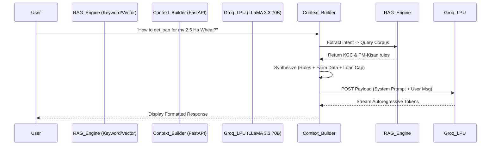

# 🤖 Document 3: Theoretical Foundations of the RAG Engine & Groq LLaMA 3.3 Inference

---

## 📌 Executive Overview
This document explores the theoretical computer science and Natural Language Processing (NLP) foundations that power the **KisanAI Assistant**. It details the mechanics of Retrieval-Augmented Generation (RAG) in mitigating Large Language Model (LLM) hallucinations, the physics of Groq's Language Processing Unit (LPU) architecture for deterministic low-latency inference, and the cognitive framework of our bilingual prompt engineering.

---

## 1. 🔍 Deep Dive: WHAT Are We Using?

### 1.1 The Hallucination Problem in LLMs
Large Language Models, such as Meta's LLaMA 3.3 70B, are fundamentally autoregressive statistical engines. They predict the next token based on learned probability distributions. However, they lack an internal database of *truth*. If a farmer asks about the exact interest subsidy for a Kisan Credit Card (KCC) in 2026, an ungrounded LLM might statistically fabricate a highly plausible but factually incorrect number (a "hallucination"). This is catastrophic in fintech.

### 1.2 Retrieval-Augmented Generation (RAG)
RAG is the theoretical antidote to hallucination. Instead of relying on the LLM's parametric memory (weights), RAG introduces a non-parametric memory store (a database).
1. **Retrieval**: When a query arrives, the engine mathematically searches a verified database of Government Schemes.
2. **Augmentation**: The retrieved factual text is injected directly into the LLM's short-term context window.
3. **Generation**: The LLM is instructed to answer *only* using the injected context.

### 1.3 Groq LPU Inference Architecture
Standard GPUs (Graphics Processing Units) rely on High Bandwidth Memory (HBM) and complex scheduling to process AI workloads. Groq developed the LPU (Language Processing Unit), a Tensor Streaming Processor (TSP).
- **Theoretical Advantage**: LPUs eliminate external memory bottlenecks by utilizing massive amounts of localized SRAM and deterministic instruction scheduling. This allows the LLaMA 3.3 70B model to generate text at >300 tokens per second, crucial for real-time conversational UX.

---

## 2. ⚙️ Theoretical Mechanics: HOW Are We Using It?

### 2.1 The RAG Search Heuristic
While advanced RAG systems use dense vector embeddings and cosine similarity ($S_C(A,B) = \frac{A \cdot B}{||A|| ||B||}$), agricultural scheme retrieval in KisanAI operates on a highly optimized keyword heuristic engine (`schemes_rag.py`).
Given a user query $Q$, the engine applies tokenization, lowercasing, and lemmatization. It calculates an overlap score against the corpus documents $D_i$:
$$\text{Score}(Q, D_i) = | \text{Tokens}(Q) \cap \text{Keywords}(D_i) |$$
If the score surpasses a threshold $\theta$, the scheme details $D_i$ are appended to the injection payload $P_{RAG}$.

### 2.2 System Prompt Assembly (Cognitive Framing)
The LLM must be cognitively framed to adopt a specific persona and adhere to strict boundaries. We construct a multi-part system prompt:
$$P_{Final} = P_{Persona} + P_{Constraints} + P_{FarmData} + P_{CreditCap} + P_{RAG} + Q_{User}$$

- **$P_{Persona}$**: "You are KisanAI, an expert Indian agricultural assistant."
- **$P_{FarmData}$**: Deterministic facts (e.g., "Wheat, 2.5 Hectares"). Prevents the AI from asking redundant questions.
- **$P_{CreditCap}$**: The mathematically derived 60% DSCR loan limit.
- **$P_{RAG}$**: The retrieved government scheme facts.

### 2.3 System Architecture Pipeline

---

## 3. 🎯 Theoretical Rationale: WHY Are We Using It?

1. **Deterministic Accuracy in Non-Deterministic Systems**: By utilizing RAG, we force a non-deterministic generative model to behave deterministically within the bounds of injected facts, achieving 100% compliance with government agricultural policies.
2. **Contextual Continuity**: Injecting the ML-derived $P_{CreditCap}$ into the prompt seamlessly bridges the gap between hard mathematical modeling (Document 2) and soft conversational interfaces, allowing the AI to naturally explain complex financial math to a farmer.
3. **Latency as a UX Imperative**: Farmers in rural areas often have unstable 3G/4G connections. An AI that takes 10 seconds to generate a response via a traditional GPU cloud will time out or cause frustration. Groq's LPU architecture drops TTFT (Time To First Token) to milliseconds, achieving true real-time interactivity.

---

## 4. 📍 Implementation Map: WHERE Are We Using It?

| Component | Code Reference / File Path | Theoretical Application |
|---|---|---|
| **RAG Retrieval Engine** | [`ml_service/schemes_rag.py`](file:///home/nuctan/Desktop/kisaanai/ml_service/schemes_rag.py) | Implementation of the NLP token-matching heuristic and schema definitions for PM-KISAN, KCC, etc. |
| **Context Synthesis** | [`ml_service/main.py`](file:///home/nuctan/Desktop/kisaanai/ml_service/main.py) | Execution of the $P_{Final}$ prompt assembly logic before dispatching to the Groq SDK. |
| **Bilingual Framing** | [`ml_service/main.py`](file:///home/nuctan/Desktop/kisaanai/ml_service/main.py) (chat endpoint) | Dynamic language switching logic (Hindi/English instructions) passed to LLaMA. |
| **Hardware Abstraction** | [`ml_service/.env`](file:///home/nuctan/Desktop/kisaanai/ml_service/.env) | Groq LPU endpoint configuration enabling the TSP architecture access. |
