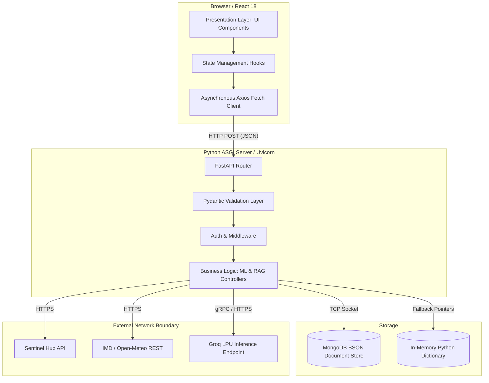

# 🏛️ Document 4: Theoretical System Integration & Full Stack Architecture

---

## 📌 Executive Overview
This document delineates the software engineering principles, architectural patterns, and structural decisions governing **KisanAI**. It explains the rationale behind a decoupled micro-frontend/API backend approach, the asynchronous concurrency model in Python, and the NoSQL distributed data philosophy.

---

## 1. 🔍 Deep Dive: WHAT Are We Using?

### 1.1 The Frontend Subsystem (React 18 + Vite 6)
- **Virtual DOM Theory**: React operates on a Virtual Document Object Model (VDOM), calculating UI state differences in memory (reconciliation algorithm) before applying the minimal required mutations to the actual browser DOM. This ensures 60 FPS performance even during complex state changes (e.g., polygon coordinate updates).
- **Vite Build Mechanics**: Unlike Webpack which crawls the entire dependency graph before serving, Vite leverages native ES Modules (ESM) in the browser, compiling code on-demand. This reduces hot-module replacement (HMR) times from seconds to milliseconds.

### 1.2 The Backend Subsystem (Python FastAPI)
- **Asynchronous I/O (ASGI)**: FastAPI is built on Starlette and Pydantic. It utilizes Python's `asyncio` event loop. Instead of blocking a thread while waiting for a network response (e.g., from Sentinel Hub or MongoDB), the thread yields control, allowing a single CPU core to handle thousands of concurrent API requests.
- **Pydantic Type Validation**: Enforces strict mathematical schemas on incoming JSON payloads, automatically rejecting malformed GIS coordinates or negative land areas before they reach the ML engine.

### 1.3 The Data Layer (MongoDB + PyMongo)
- **NoSQL Document Theory**: Agricultural farm profiles are deeply nested, heterogeneous data structures. Relational databases (SQL) require rigid, normalized schemas and expensive `JOIN` operations. MongoDB stores data as BSON (Binary JSON), allowing seamless serialization/deserialization between the Python backend and React frontend.
- **In-Memory Fallback Mechanism**: To ensure zero-dependency execution environments (e.g., isolated sandboxes or local dev without Docker), a polymorphic Database Interface automatically degrades to a Python Dictionary store if a TCP connection to MongoDB fails.

---

## 2. ⚙️ Theoretical Mechanics: HOW Are We Using It?

### 2.1 State Synchronization (Frontend to Backend)
The architecture follows a strict unidirectional data flow and stateless RESTful API design.
1. The React frontend maintains local state (Farm Area, Crop, Polygon Coordinates).
2. Upon user confirmation, state is serialized into a JSON payload and transmitted via HTTP POST.
3. The FastAPI backend is **stateless**. It reconstructs context entirely from the incoming payload, executes the ML models (Doc 2) and GIS queries (Doc 1), and returns a deterministic JSON evaluation.
4. React receives the evaluation, triggers a re-render of the Virtual DOM, and updates the UI visualization cards.

### 2.2 Unified System Architecture Diagram

---

## 3. 🎯 Theoretical Rationale: WHY Are We Using It?

1. **Language Affinity (Why Python for Backend?)**: Modern AI/ML, Data Science, and GIS processing are intrinsically tied to the Python ecosystem (NumPy, PyTorch, Rasterio). Using Node.js or Java for the backend would require brittle Inter-Process Communication (IPC) or microservice overhead to talk to the ML models. FastAPI allows direct, in-memory execution of the mathematical scoring models.
2. **Component Isolation**: The decoupled architecture ensures that if the Groq LLM API goes down, the core Agricultural Credit Scoring engine remains 100% operational.
3. **Event-Driven Resilience**: The asynchronous design of FastAPI ensures that slow network calls (like retrieving massive 12-month historical rainfall datasets from Open-Meteo) do not bottleneck the server, maintaining high throughput.

---

## 4. 📍 Implementation Map: WHERE Are We Using It?

| Component / Layer | Code Reference / File Path | Architectural Role |
|---|---|---|
| **ASGI Server Entry** | [`ml_service/main.py`](file:///home/nuctan/Desktop/kisaanai/ml_service/main.py) | Bootstraps the Uvicorn server, defines API routes (`/api/ai/analyze`), and registers CORS middleware. |
| **Data Persistence Abstraction** | [`ml_service/db.py`](file:///home/nuctan/Desktop/kisaanai/ml_service/db.py) | Implements the polymorphic database connection (MongoDB `pymongo.MongoClient` with graceful fallback to `in_memory_db`). |
| **React View Layer** | [`frontend/src/pages/Dashboard.jsx`](file:///home/nuctan/Desktop/kisaanai/frontend/src/pages/Dashboard.jsx) | Acts as the primary Controller-View, managing React state and orchestrating child components (Cards, Maps). |
| **Bilingual Translation Engine** | [`frontend/src/utils/translations.js`](file:///home/nuctan/Desktop/kisaanai/frontend/src/utils/translations.js) | Static dictionary module serving localized strings to React components based on the dynamic `lang` state prop. |
