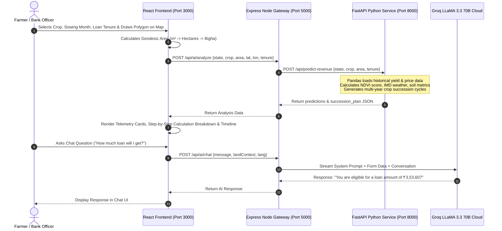

# 04. System Working Visualization & Data Flow Diagrams

This document visualizes the complete end-to-end operational flow of **Kisan Credit AI**.

---

## 1. End-to-End System Sequence Diagram



---

## 2. Dynamic Land Area & Telemetry Pipeline Data Flow

```
[ User Clicks & Draws Polygon on Sentinel-2 Satellite Map ]
                         │
                         ▼
           [ FarmlandMap.jsx Component ]
                         │
          Computes Geodesic Area via Haversine
          Area (m²) ──> Hectares ──> Bigha
                         │
                         ▼
        [ Trigger POST /api/ai/analyze ]
                         │
                         ▼
          [ FastAPI data_loader.py ]
   Filter CSV by State ("Maharashtra") & Crop ("Wheat")
   Fetch Historical Yield = 3.5 Tonnes/Ha
   Fetch Mandi Price = ₹2,275 / Quintal
                         │
                         ▼
            [ FastAPI scoring.py ]
   Calculate Satellite NIR/Red Band NDVI Score (e.g. 0.78)
   Fetch Climate Weather & Rain Score from IMD API
                         │
                         ▼
        [ FastAPI crop_succession.py ]
   Cycle 1: Current Wheat (Nov-Apr) = ₹2,39,443
   Cycle 2: Summer Mung Bean (May-Jul) = ₹1,28,060
   Cycle 3: Monsoon Paddy (Aug-Dec) = ₹2,21,901
                         │
                         ▼
           [ Safe Credit Cap Formula ]
   Total Combined Revenue = ₹5,89,404
   Loan Cap (60%) = ₹3,53,642
```

---

## 3. Groq LLaMA AI Chatbot Context Synchronization Flow

```
+-------------------------------------------------------------------+
|                     DASHBOARD FORM STATE                          |
| State: Maharashtra | District: Ahilyanagar | Crop: Wheat          |
| Area: 3.37 Ha     | Sowing: November     | Tenure: 1 Year       |
+-------------------------------------------------------------------+
                                 │
                                 ▼
+-------------------------------------------------------------------+
|               REACT FRONTEND STATE SYNC (useEffect)               |
| Injects live formState into Chat Welcome & Context Payload        |
+-------------------------------------------------------------------+
                                 │
                                 ▼
+-------------------------------------------------------------------+
|                EXPRESS AI CONTROLLER (aiController.js)            |
| Auto-detects User Language (English / Hindi)                     |
| Builds System Prompt:                                             |
| "CONFIRMED FARMER DETAILS: Wheat, 3.37 Ha, Ahilyanagar"           |
| "STRICT RULE: Never re-ask for entered details!"                 |
| "ANSWER MANDATE: 'You are eligible for loan amount ₹3,53,607'"    |
+-------------------------------------------------------------------+
                                 │
                                 ▼
+-------------------------------------------------------------------+
|                     GROQ LLAMA 3.3 70B LPU                        |
| Generates instant response in requested language                   |
+-------------------------------------------------------------------+
```
