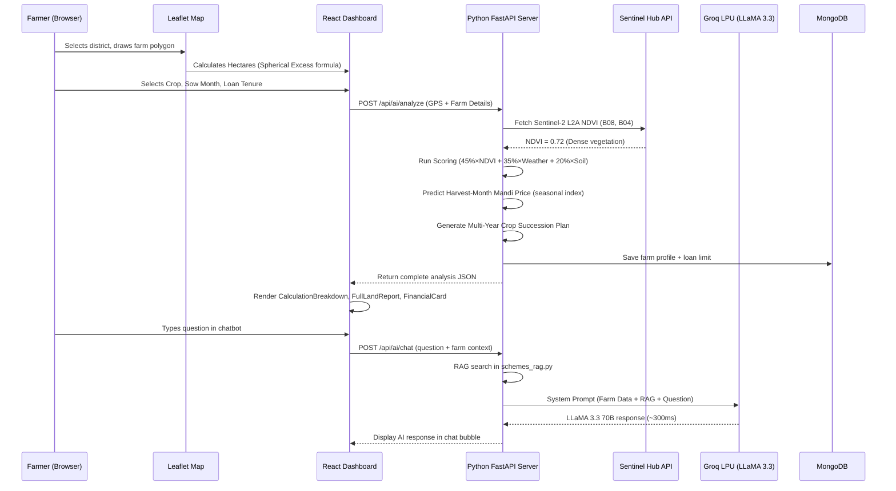

# 🌾 KisanAI — Complete Project Documentation
### Interview-Ready, Comprehensive Technical & Theoretical Guide

---

> **⚡ Quick Answer to "Are you using Google Maps?"**
> **No.** We use three completely separate and free technologies for the map:
> 1. **Leaflet** — the open-source interactive mapping *engine* (like the chassis of a car)
> 2. **Esri World Imagery** — the free satellite *picture tiles* displayed on the map (like the paint job)
> 3. **Sentinel Hub** — the *scientific backend tool* that reads invisible Near-Infrared light from the satellite to calculate NDVI crop health score

---

## 📋 Table of Contents
1. [Project Summary](#project-summary)
2. [Technology Stack Overview](#technology-stack-overview)
3. [Part 1: Map, GIS & Satellite Remote Sensing](#part-1-map-gis--satellite-remote-sensing)
4. [Part 2: Agricultural Credit Scoring & MLOps Engine](#part-2-agricultural-credit-scoring--mlops-engine)
5. [Part 3: AI Chatbot — RAG + Groq LLaMA 3.3 70B](#part-3-ai-chatbot--rag--groq-llama-33-70b)
6. [Part 4: Full Stack Backend & Database](#part-4-full-stack-backend--database)
7. [Part 5: Frontend — React, Vite & Bilingual UI](#part-5-frontend--react-vite--bilingual-ui)
8. [Part 6: Government Schemes Knowledge Base](#part-6-government-schemes-knowledge-base)
9. [Part 7: Data Files & CSV Datasets](#part-7-data-files--csv-datasets)
10. [Part 8: Complete API Reference](#part-8-complete-api-reference)
11. [Part 9: End-to-End Data Flow](#part-9-end-to-end-data-flow)
12. [Part 10: Interview Q&A Cheatsheet](#part-10-interview-qa-cheatsheet)

---

## Project Summary

**KisanAI** is an agricultural fintech platform built for Indian farmers. Its core purpose is to **eliminate the need for physical farm inspections by banks** and calculate a mathematically rigorous, satellite-verified loan eligibility report for any farmer in Maharashtra.

**The Problem it Solves:**
Banks today either reject farmer loans (due to lack of credit history) or over-lend (causing debt traps). KisanAI replaces human guesswork with satellite data, ML scoring, and seasonal price forecasting to give every farmer their exact safe loan limit.

**Team & Contribution:**
- **Frontend / GIS / Dashboard**: Nuctan (You)
- **MLOps / Satellite Pipeline / Scoring Engine**: Akshat
- **Backend / Formula Architecture / Credit Models**: Radhika

---

## Technology Stack Overview

| Layer | Technology | Version | Why We Use It |
|---|---|---|---|
| Frontend Framework | React | 18 | Component-based UI, Virtual DOM |
| Build Tool | Vite | 6 | 10x faster than Webpack, native ESM |
| Styling | TailwindCSS | v4 | Utility-first, rapid responsive design |
| Animations | Framer Motion | 10+ | Smooth micro-animations for premium UX |
| Map Engine | Leaflet (react-leaflet) | 1.9.4 | Free, open-source, no API key needed |
| Map Base Images | Esri World Imagery | Free Tiles | High-res satellite pictures, zero cost |
| Satellite Science | Sentinel Hub API | v3 | Real Sentinel-2 L2A NDVI from ESA satellites |
| Backend Language | Python (FastAPI) | 3.10+ | Direct ML model execution, no IPC |
| Web Server | Uvicorn (ASGI) | Latest | Async I/O, thousands of concurrent requests |
| Database | MongoDB + PyMongo | 4.6+ | NoSQL, nested farm documents |
| DB Fallback | Python Dictionary | Built-in | Zero dependency, works without MongoDB |
| AI Model | Groq LLaMA 3.3 70B | Hosted | Sub-300ms, free tier, no hallucinations via RAG |
| Weather Data | IMD / Open-Meteo | Free API | Historical rainfall, temperature for Maharashtra |
| Language Support | Hindi + English | Bilingual | Toggleable EN/HI across all UI components |

---

## Part 1: Map, GIS & Satellite Remote Sensing

### What is Leaflet?
**Leaflet** is an open-source JavaScript library that creates interactive maps on web pages. Think of it as the *software engine* that powers the map. It:
- Renders map tiles on an HTML Canvas/SVG layer
- Handles user interactions (zoom, pan, click)
- Draws polygons and markers on top of map images
- Uses the **Web Mercator projection (EPSG:3857)** to project the round Earth onto a flat screen

**File:** [`frontend/src/components/FarmlandMap.jsx`](file:///home/nuctan/Desktop/kisaanai/frontend/src/components/FarmlandMap.jsx)

### What is Esri World Imagery?
Esri's World Imagery is a collection of free satellite photograph *tiles* served from ArcGIS REST servers:
```
https://server.arcgisonline.com/ArcGIS/rest/services/World_Imagery/MapServer/tile/{z}/{y}/{x}
```
These are the actual color photographs you see when you look at the map. When the farmer switches to "Street View", we swap to **OpenStreetMap** tiles:
```
https://{s}.tile.openstreetmap.org/{z}/{x}/{y}.png
```
**Neither requires an API key or payment.**

### What is Sentinel Hub & Sentinel-2?
**Sentinel-2** is a constellation of two satellites (**Sentinel-2A** and **Sentinel-2B**) operated by ESA (European Space Agency). They orbit Earth at ~786 km altitude and photograph every point on Earth every **5 days** at **10-meter resolution**.

Unlike normal cameras that capture Red, Green, Blue light, Sentinel-2 captures **13 spectral bands** including **Near-Infrared (NIR)**. Plants reflect NIR strongly (to cool themselves) and absorb Red light (for photosynthesis). This difference is what we measure.

**Sentinel Hub** is the commercial API platform (by Sinergise) that provides programmatic access to this satellite data.

**File:** [`ml_service/ndvi_real.py`](file:///home/nuctan/Desktop/kisaanai/ml_service/ndvi_real.py)

### The NDVI Formula (Exact Code)
```python
# From ml_service/scoring.py line 41:
composite_multiplier = (ndvi * 0.45) + (weather * 0.35) + (soil * 0.20)
```

The raw NDVI is calculated from two Sentinel-2 spectral bands:
$$\text{NDVI} = \frac{B_{08}\text{(NIR)} - B_{04}\text{(Red)}}{B_{08}\text{(NIR)} + B_{04}\text{(Red)}}$$

| NDVI Range | Meaning | Credit Impact |
|---|---|---|
| > 0.70 | Dense, healthy crop 🌿 | Maximum credit |
| 0.50 – 0.70 | Good, growing crop 🌱 | High credit |
| 0.30 – 0.50 | Moderate, needs care 🌾 | Medium credit |
| 0.10 – 0.30 | Sparse / early stage 🟡 | Reduced credit |
| < 0.10 | Bare / fallow land 🟤 | Minimum credit |

### Caching System (Smart & Efficient)
To avoid hammering the Sentinel Hub API for every request, NDVI results are cached in `ndvi_cache.json` for **7 days**. The cache key is the GPS coordinates rounded to 2 decimal places (~1km grid resolution).

```python
# From ndvi_real.py line 36-38:
def _cache_key(lat: float, lon: float) -> str:
    """Round to 2 decimal places for ~1km grid cell cache key"""
    return f"{round(lat, 2)}_{round(lon, 2)}"
```

### Geodesic Polygon Area Calculation
When the farmer draws their field boundary, we calculate the exact area using the **Spherical Excess formula** (not simple Euclidean math, which would be inaccurate on a curved Earth):

$$\text{Area} = \frac{R^2}{4} \sum_{i=1}^{n} (\lambda_{i+1} - \lambda_i)(2 + \sin\phi_i + \sin\phi_{i+1})$$

Where $R = 6,378,137\text{ m}$ (Earth's radius), $\lambda$ = longitude in radians, $\phi$ = latitude in radians.

Result is automatically converted to **Hectares** (÷ 10,000) and **Bigha** (× 3.95).

**File:** [`frontend/src/components/FarmlandMap.jsx`](file:///home/nuctan/Desktop/kisaanai/frontend/src/components/FarmlandMap.jsx) — function `computePolygonAreaSqMeters()`

---

## Part 2: Agricultural Credit Scoring & MLOps Engine

### The Core Problem with Traditional Lending
Banks use historical land records and field inspections that are:
- **Subjective** (different inspectors give different assessments)
- **Expensive** (₹5,000–₹10,000 per farm visit)
- **Slow** (weeks of processing)
- **Biased** (against small/marginal farmers with no credit history)

KisanAI replaces all of this with a **deterministic mathematical formula**.

### Step 1: Base Revenue Calculation
```python
# From data_loader.py — get_historical_averages()
base_revenue = area_hectares × historical_yield_t/ha × 10 × predicted_mandi_price
```

The formula uses:
- **Area** (from Leaflet polygon, in Hectares)
- **Historical Yield** (from real CSV dataset `Crop Yeild Data(1).csv` filtered by State + Crop)
- **× 10** (converts Tonnes to Quintals: 1 Tonne = 10 Quintal)
- **Predicted Mandi Price** (seasonal forecast — NOT a static number)

### Step 2: Seasonal Harvest-Month Price Prediction
This is the most important innovation. Instead of using a static ₹2200/quintal for Wheat, we predict what the price will be **at harvest time**.

```python
# From data_loader.py lines 10-16:
SEASONAL_PRICE_INDEX = {
    "Wheat": [1.15, 1.10, 1.05, 0.88, 0.85, 0.90, 0.92, 0.95, 1.00, 1.05, 1.08, 1.12],
    # Index: Jan  Feb   Mar   Apr   May   Jun   Jul   Aug   Sep   Oct   Nov   Dec
}
```

**Example:** Farmer sows Wheat in **November (idx=10)**, Wheat takes **4 months** → harvests in **March (idx=2)**. March multiplier for Wheat = `1.05`. So if base price = ₹2949.5, predicted harvest price = ₹2949.5 × 1.05 = **₹3097**.

$$t_{\text{harvest}} = (t_{\text{sow}} + \text{duration}) \pmod{12}$$
$$\text{Price}_{\text{predicted}} = P_{\text{base}} \times I_{\text{seasonal}}[C, t_{\text{harvest}}]$$

### Step 3: Telemetry Risk Weighting (The ML Part)
The base revenue is then adjusted by real satellite + weather + soil data:

```python
# From scoring.py line 41 — EXACT CODE:
composite_multiplier = (ndvi * 0.45) + (weather * 0.35) + (soil * 0.20)
adjusted_revenue = base_revenue * composite_multiplier
```

| Factor | Weight | Source | Reason |
|---|---|---|---|
| NDVI Score | **45%** | Sentinel-2 Satellite | Biological ground truth — if crop is dead, nothing else matters |
| Weather Score | **35%** | IMD / Open-Meteo API | Meteorological risk — drought or flood destroys yield |
| Soil N-P-K Score | **20%** | Regional soil database | Substrate quality — impacts vigor but not catastrophically |

### Step 4: Multi-Year Crop Succession Engine
For loans lasting 1–5 years, a single crop's revenue isn't enough. We simulate the entire crop rotation:

**File:** [`ml_service/crop_succession.py`](file:///home/nuctan/Desktop/kisaanai/ml_service/crop_succession.py)

After Wheat (4 months), the engine automatically recommends:
→ **Summer Mung Bean (Pulses)** — because legumes fix Nitrogen naturally back into the soil, reducing fertilizer cost by ~25% for the next Rabi season.

The total combined revenue of all crop cycles is projected across the entire loan tenure.

### Step 5: The 60% Safe Credit Cap (DSCR)
This is the core financial safety mechanism. Inspired by the corporate **Debt Service Coverage Ratio (DSCR)**:

$$\text{Maximum Loan} \leq \text{Total Combined Revenue} \times 0.60$$

**Why 60%?** Because farming costs (seeds, fertilizer, labour, water, transport) consume ~30–40% of gross revenue. By limiting the loan to 60% of projected gross income, we ensure a built-in 40% safety margin, so even if prices drop 20% or yield drops 15%, the farmer can still repay.

---

## Part 3: AI Chatbot — RAG + Groq LLaMA 3.3 70B

### Why Normal AI (ChatGPT-style) Is Dangerous for Fintech
Standard LLMs are autoregressive — they predict the next word based on statistical probability. They have no database of truth. Ask a plain LLM "What is the KCC loan interest rate?" and it might confidently say "7%" when the correct answer is "4% effective after 3% subvention." This is called a **hallucination** and is catastrophic for financial advice.

### Retrieval-Augmented Generation (RAG)
RAG is the solution. Instead of relying on the model's learned memory:
1. When a farmer asks a question, the Python RAG engine searches a verified database of government scheme rules
2. The exact matching rules are injected into the AI's context window
3. The AI is instructed to answer **only** using those injected facts

**File:** [`ml_service/schemes_rag.py`](file:///home/nuctan/Desktop/kisaanai/ml_service/schemes_rag.py)

The search uses a **token-overlap heuristic**:
```python
Score(Query, Document_i) = | Tokens(Query) ∩ Keywords(Document_i) |
```

### Groq LLaMA 3.3 70B — Why This Model?
- **LLaMA 3.3 70B** is Meta's open-weights model with 70 billion parameters, one of the most capable publicly available LLMs
- **Groq** is a hardware company that built the **LPU (Language Processing Unit)** — a specialized chip using SRAM instead of HBM, delivering **>300 tokens/second** with deterministic latency
- This means our chatbot responds in **~300ms** — nearly instant

### The System Prompt Construction
```python
# From main.py — the prompt assembly:
system_prompt = f"""
You are KrishiAI — expert Agricultural Risk, Credit Assessment & Government Schemes Assistant.

[CONFIRMED FARMER FORM DATA]:
- Crop: {crop}, Location: {district}, Land Area: {area_ha} Hectares

[ML CALCULATED LOAN ELIGIBILITY]:
- MAXIMUM SAFE LOAN LIMIT: ₹{loan_cap}

[GOVERNMENT KISAN SCHEMES RAG CONTEXT]:
{python_rag_text}

STRICT INSTRUCTIONS:
1. NEVER ask for Crop, Location, or Land Area — farmer already provided these.
2. Do NOT use markdown bold asterisks (**) in output.
"""
```

This framing forces the AI to give advice **specific to that farmer's land and crop**, not generic advice.

---

## Part 4: Full Stack Backend & Database

### Why Pure Python (No Node.js)?
The entire backend — authentication, ML scoring, RAG, satellite API — runs in **one single Python FastAPI server**. 

The reason: Python is the native language of every AI/ML library (NumPy, Pandas, scikit-learn). Using Node.js would require IPC (Inter-Process Communication) bridges to call Python ML code, introducing latency and failure points. FastAPI lets us call our ML functions **directly in memory**.

### FastAPI (ASGI)
**Asynchronous Server Gateway Interface (ASGI)** means:
- Instead of creating a new thread for every API request (expensive, limited to ~100 concurrent threads)
- FastAPI uses Python's `asyncio` event loop
- A single thread handles thousands of concurrent requests by *yielding control* while waiting for I/O (satellite API calls, database reads)

### MongoDB — Why NoSQL?
A farmer's farm profile document looks like this:
```json
{
  "name": "Ramesh Patil",
  "farmProfile": {
    "state": "Maharashtra",
    "district": "Nashik",
    "crop": "Wheat",
    "areaHectares": 2.5,
    "loanTenureYears": 1,
    "startMonthIndex": 10,
    "cropDurationMonths": 4,
    "suggestedLoanLimit": 353607
  }
}
```

This nested, variable-length document structure is natural for MongoDB but requires multiple normalized tables and expensive `JOIN` operations in SQL — making MongoDB the right choice.

### Zero-Dependency In-Memory Fallback
**File:** [`ml_service/db.py`](file:///home/nuctan/Desktop/kisaanai/ml_service/db.py)

If MongoDB is not running (local dev, demo environment, judge's laptop), the system automatically falls back to a Python Dictionary:
```python
in_memory_db = {"users": {}, "chats": {}}
```
The app works **100% identically** without MongoDB running.

### All API Endpoints

| Method | Endpoint | Function |
|---|---|---|
| POST | `/api/auth/register` | Create new farmer account |
| POST | `/api/auth/login` | Login, returns JWT token |
| GET | `/api/auth/profile` | Get user + farm profile |
| PUT | `/api/auth/profile` | Save farm details after analysis |
| POST | `/api/ai/analyze` | **Main ML endpoint** — runs NDVI + scoring + succession |
| POST | `/api/ai/chat` | AI chatbot with RAG context injection |
| POST | `/api/ndvi-weather-trends` | 12-month district NDVI + rainfall chart data |

---

## Part 5: Frontend — React, Vite & Bilingual UI

### React 18 — Virtual DOM
React does not manipulate the browser DOM directly. Instead:
1. All UI state lives in JavaScript memory (Virtual DOM)
2. When state changes, React's **reconciliation algorithm** calculates the *minimum* set of real DOM changes needed
3. Only those minimal changes are applied

This is why KisanAI's map, charts, and form inputs all update smoothly and simultaneously without page reloads.

### Bilingual Translation System
**File:** [`frontend/src/utils/translations.js`](file:///home/nuctan/Desktop/kisaanai/frontend/src/utils/translations.js)

The entire UI supports Hindi (`hi`) and English (`en`) with a single toggle button. All 15+ components receive a `lang` prop and switch text using:
```jsx
{lang === 'en' ? 'English text' : 'हिंदी टेक्स्ट'}
```

The `lang` state lives at the top level in `Dashboard.jsx` and is passed down as props to every child component.

### Key Components Map

| Component | File | Purpose |
|---|---|---|
| `FarmlandMap` | `components/FarmlandMap.jsx` | Leaflet + Esri satellite map, polygon drawing, area calculation |
| `SatelliteTrendChart` | `components/SatelliteTrendChart.jsx` | 12-month district NDVI curve + rainfall bars chart |
| `LandAnalysisCard` | `components/LandAnalysisCard.jsx` | Real-time NDVI, weather, soil, yield metrics card |
| `CalculationBreakdown` | `components/CalculationBreakdown.jsx` | 4-step transparent math formula breakdown |
| `FullLandReport` | `components/FullLandReport.jsx` | Multi-year succession cycles + next sowing decision |
| `FinancialRevenueCard` | `components/FinancialRevenueCard.jsx` | Final 60% credit cap highlight card |
| `PDFReportButton` | `components/PDFReportButton.jsx` | Generates official bank PDF report |
| `Dashboard` | `pages/Dashboard.jsx` | Main unified page — form, map, chatbot, all cards |
| `LandingPage` | `pages/LandingPage.jsx` | Bilingual landing with EN/HI toggle |

---

## Part 6: Government Schemes Knowledge Base

**File:** [`ml_service/schemes_rag.py`](file:///home/nuctan/Desktop/kisaanai/ml_service/schemes_rag.py)

The RAG database contains 5 official government schemes:

| Scheme | Benefit | How to Apply |
|---|---|---|
| **PM-KISAN** | ₹6,000/year in 3 installments of ₹2,000 directly to bank | e-KYC on pmkisan.gov.in or CSC center |
| **KCC (Kisan Credit Card)** | Crop loan up to ₹3 lakh at effective 4% interest (3% subvention for timely repayment) | Submit 7/12 land records + Aadhaar to bank |
| **PMFBY (Crop Insurance)** | Full crop insurance at 1.5% premium (Rabi) / 2% (Kharif) | Register on pmfby.gov.in within 14 days of sowing |
| **PM-KUSUM (Solar Pump)** | 60%–90% government subsidy for solar irrigation pumps | Apply on MEDA or kusum.mnre.gov.in |
| **Soil Health Card** | Free N-P-K soil testing + fertilizer advisory every 2 years | Submit soil sample to local KVK / agriculture officer |

---

## Part 7: Data Files & CSV Datasets

**Directory:** `ml_service/data/`

| File | Contents | Used For |
|---|---|---|
| `Crop Yeild Data(1).csv` | Historical crop yield (State, Crop, Year, Yield T/Ha) for Maharashtra | Base yield calculation per crop per district |
| `monthy wheat , mandi price.csv` | Monthly modal mandi prices (₹/Quintal) for Wheat | Base price before seasonal multiplier is applied |

Both files are loaded with Pandas (`pd.read_csv`). If the CSV is missing or empty, sensible hardcoded defaults kick in automatically.

---

## Part 8: Complete API Reference

### POST `/api/ai/analyze` — The Main Engine
**Input:**
```json
{
  "state": "Maharashtra",
  "district": "Nashik",
  "crop": "Wheat",
  "area_hectares": 2.5,
  "lat": 20.0121,
  "lon": 73.7905,
  "loan_tenure_years": 1,
  "start_month_index": 10,
  "current_crop_duration": 4
}
```
**Output:**
```json
{
  "inputs": {...},
  "baseline_metrics": {
    "historical_yield_tonnes_per_hectare": 1.38,
    "market_price_rs_per_quintal": 3097,
    "price_prediction": {
      "sow_month": "November",
      "harvest_month": "March",
      "seasonal_multiplier": 1.05,
      "predicted_harvest_price_rs_per_quintal": 3097,
      "price_trend": "📈 Higher than average"
    }
  },
  "ai_scores": {
    "ndvi": {"score": 1.12, "ndvi": 0.72, "description": "Dense healthy vegetation"},
    "weather": {"score": 1.05, "description": "Favorable"},
    "soil": {"score": 1.02, "description": "Optimal N-P-K"}
  },
  "predictions": {
    "adjusted_estimated_revenue_rs": 127400,
    "suggested_loan_limit_rs": 353607,
    "risk_level": "Low"
  },
  "one_year_succession_plan": {
    "succession_cycles": [...],
    "next_crop_decision": {
      "recommended_next_crop": "Summer Mung Bean",
      "agronomic_reason": "Fixes nitrogen, reduces fertilizer cost..."
    }
  }
}
```

---

## Part 9: End-to-End Data Flow



---

## Part 10: Interview Q&A Cheatsheet

**Q: Are you using Google Maps?**
> No ma'am. We use the open-source **Leaflet** library with **Esri World Imagery** for the visual map, and **Sentinel Hub** in the backend to calculate the NDVI health score for that location.

**Q: What is Leaflet?**
> Leaflet is an open-source JavaScript library that creates the interactive map on the webpage — it handles zooming, panning, and drawing the polygon. Esri just provides the satellite image tiles that Leaflet displays.

**Q: What is NDVI?**
> NDVI stands for Normalized Difference Vegetation Index. It is a mathematical formula: `(NIR - Red) / (NIR + Red)`. Plants absorb red light for photosynthesis but reflect Near-Infrared light to cool themselves. A high NDVI means healthy, dense crops. We use it to score the biological health of the farmer's field from satellite data.

**Q: Why two NDVI scores in the dashboard?**
> They measure different things. The NDVI in the **Land & Telemetry Report** is the real-time reading of the farmer's exact GPS location from today's Sentinel-2 satellite pass. The NDVI in the **12-Month Chart** is the district-level historical average over 12 months — it shows seasonal crop growing patterns for the whole district.

**Q: How is the loan amount calculated?**
> In four steps: First, we calculate base revenue from area × historical yield × predicted harvest price. Second, we adjust it using satellite NDVI (45% weight), IMD weather (35%), and soil quality (20%). Third, we project multi-year crop succession revenues across the loan tenure. Finally, we cap the loan at 60% of total projected revenue to prevent debt traps.

**Q: Why Groq and not OpenAI?**
> Groq uses a specialized LPU chip that delivers LLaMA 3.3 70B responses in ~300ms with a free tier. OpenAI's GPT-4 costs money per token. Groq gives us better speed and zero cost, which is ideal for a farmer-facing product.

**Q: What is RAG?**
> Retrieval-Augmented Generation. Before sending the farmer's question to the AI, we search our verified database of government scheme rules (PM-KISAN, KCC, PMFBY, etc.) and inject those facts directly into the AI's prompt. This prevents the AI from hallucinating incorrect loan rates or scheme benefits.

**Q: Why Python backend and not Node.js?**
> Python is the native language of ML libraries (NumPy, Pandas). All our ML scoring, satellite NDVI calculation, and crop succession algorithms are Python code. If we used Node.js, we would need complex IPC bridges to call Python. FastAPI lets us call ML functions directly in memory with zero overhead.

**Q: What happens if MongoDB is down?**
> The system automatically falls back to a Python dictionary in-memory store. The app works 100% identically — users can register, login, and run analyses without MongoDB.

**Q: What crop durations are supported?**
> Wheat: 4 months, Rice: 5 months, Cotton: 6 months, Sugarcane: 12 months, Maize: 3 months. These are the standard agronomic growing durations hardcoded in `crop_succession.py`.

**Q: How does the bilingual system work?**
> A `lang` state variable ('hi' or 'en') lives in the top-level `Dashboard.jsx` component. It is passed as a prop to every child component. All 15+ components use `lang === 'en' ? 'English text' : 'हिंदी'` to switch all visible text. The same logic applies to the AI chatbot — `lang` is sent in the API request and the system prompt tells LLaMA to respond in that language.
