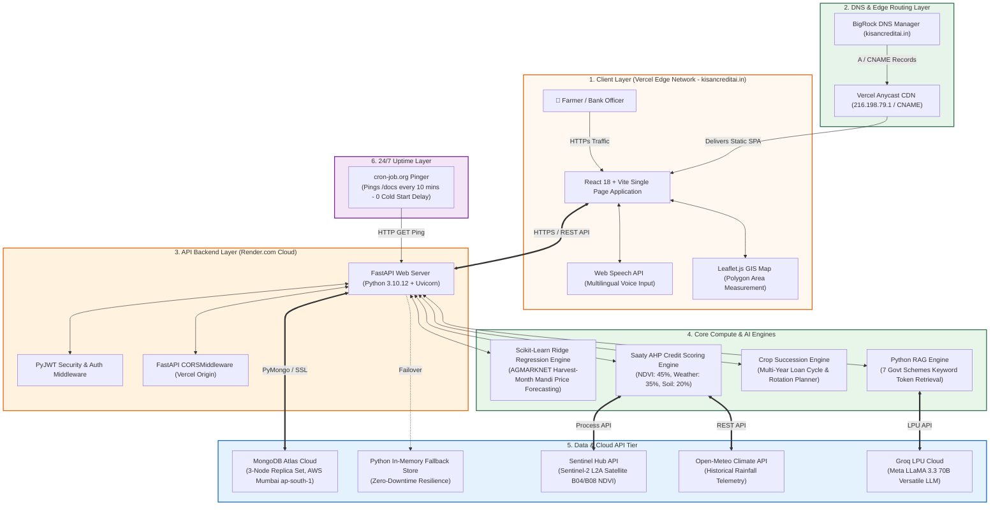
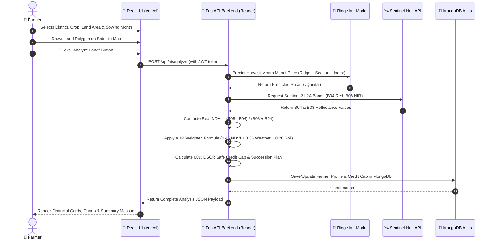

# 🏛️ KisanAI — Complete End-to-End System Architecture

> **Official System Architecture Document**  
> **Application**: KisanAI — AI-Powered Agricultural Credit Scoring & Advisory Platform  
> **Live Domain**: `https://kisancreditai.in` | **API**: `https://kisan-backend-wxsg.onrender.com/api`  
> **Repository**: https://github.com/nuctan/kisan-credit-score

---

## 📐 High-Level System Architecture Diagram

---

## 🛠️ Detailed Architectural Layer Breakdown

### Layer 1: Client & Presentation Layer (Vercel Edge Network)
- **Framework**: React 18 with Vite build bundler.
- **Styling**: Custom CSS design system (Saffron `#E8630A`, Forest Green `#2D6A4F`, Warm Cream `#FFF8F0`).
- **Typography**: Google Font *Noto Sans Devanagari* for authentic Devanagari script rendering.
- **Interactive Mapping**: Leaflet.js (`react-leaflet`) with custom farmland polygon drawing and geodesic area calculation ($1\text{ Ha} = 10,000\text{ m}^2$).
- **Voice Capabilities**: Native browser Web Speech API for 6-language voice input (Hindi, English, Marathi, Gujarati, Tamil, Telugu).
- **Resilience**: Top-level React `ErrorBoundary` component preventing blank/black screen crashes on client runtime exceptions.

---

### Layer 2: DNS & Edge Routing Layer (BigRock + Vercel)
- **Domain Registrar**: BigRock (`kisancreditai.in`).
- **DNS Records**:
  - `A Record (@)` $\rightarrow$ `216.198.79.1` (Vercel Apex Edge Server)
  - `CNAME Record (www)` $\rightarrow$ `4f40f5efa32087a3.vercel-dns-017.com`
- **TLS/SSL**: Automatic 256-bit Let's Encrypt SSL certificate issuance and HTTPS enforcement.

---

### Layer 3: API & Business Logic Layer (Render.com Cloud)
- **Web Framework**: FastAPI (Python 3.10.12) running under Uvicorn ASGI server.
- **Security**: PyJWT signed token authentication (HS256) with 30-day token lifetime.
- **CORS Management**: Permissive CORS middleware allowing cross-origin requests from `kisancreditai.in` and `localhost`.
- **Runtime Environment**: Pinned via `.python-version` and `runtime.txt` to Python 3.10.12 to utilize pre-compiled binary wheel packages for NumPy, Pandas, and Scikit-Learn.

---

### Layer 4: Intelligence & Analytics Engines

#### A. Mandi Price Forecasting Engine (`ml_service/data_loader.py`)
- **Algorithm**: Scikit-Learn Ridge Linear Regression ($\alpha = 1.0$).
- **Training Data**: Historical AGMARKNET monthly modal prices for Wheat (`monthy wheat , mandi price.csv`).
- **Harvest-Month Forecasting**: Computes expected harvest month index $t_{\text{harvest}} = (t_{\text{sow}} + d) \bmod 12$ and combines linear trend with seasonal price indexing multipliers.

#### B. Credit Scoring Engine (`ml_service/scoring.py`)
- **Mathematical Framework**: Saaty Analytic Hierarchy Process (AHP, 1980).
- **Parameter Matrix**:
  - **NDVI Score ($45\%$)**: Sentinel-2 vegetative index correlation with $f_{\text{APAR}}$ biomass (Monteith, 1977).
  - **Weather Score ($35\%$)**: Rainfall & evapotranspiration deficit (FAO-56, 1998).
  - **Soil Score ($20\%$)**: District soil N-P-K nutrient & pH balance.
- **Revenue Calculation**:
  $$\text{Base Revenue} = \text{Area (Ha)} \times \text{Yield (T/Ha)} \times 10 \times P_{\text{ML Harvest Price}}$$
  $$\text{Adjusted Revenue} = \text{Base Revenue} \times (0.45 \cdot \text{NDVI} + 0.35 \cdot \text{Weather} + 0.20 \cdot \text{Soil})$$
- **Credit Limit Cap**: Enforces the 60% Debt Service Coverage Ratio (DSCR) safety rule:
  $$\text{Safe Credit Cap} = \text{Total Tenure Revenue} \times 0.60$$

#### C. Crop Succession & Rotation Engine (`ml_service/crop_succession.py`)
- Multi-season crop succession planner recommending optimal next crop (e.g. Summer Mung Bean / Pulses) based on harvest month and land availability.

#### D. Government Schemes RAG Engine (`ml_service/schemes_rag.py`)
- **Retrieval Mechanism**: Token-matching keyword scoring across 7 government scheme databases (PM-KISAN, KCC, PMFBY, PM-KUSUM, Soil Health Card, SMAM, Karjmukti).
- **LLM Synthesis**: Injects retrieved scheme text + farmer profile into **Groq LLaMA 3.3 70B Versatile** model for plain-text response generation.

---

### Layer 5: Data & External Cloud Services Layer

| Component | Service Provider | Technical Protocol |
|---|---|---|
| **MongoDB Atlas** | MongoDB Cloud (AWS Mumbai `ap-south-1`) | PyMongo Native Driver over TLS (Port 27017) |
| **In-Memory Store** | Python Native `dict` | Memory Fallback when Mongo connection fails |
| **Satellite GIS** | Sentinel Hub Process API | OAuth2 REST API (Sentinel-2 L2A B04/B08 bands) |
| **Climate Telemetry** | Open-Meteo Archive API | REST JSON API (Daily Precipitation & Temperature) |
| **LLM Inference** | Groq Cloud LPU Infrastructure | Groq Python SDK over HTTPS (LLaMA 3.3 70B) |

---

### Layer 6: 24/7 Uptime & Keep-Alive Layer
- **Service**: cron-job.org
- **Frequency**: Every 10 minutes
- **Target**: `https://kisan-backend-wxsg.onrender.com/docs`
- **Impact**: Prevents Render free-tier container from entering sleep mode, ensuring zero cold-start delay for all users.

---

## 🔄 Sequence Diagram: Farm Land Analysis Flow

---

## 🔮 Architectural Evolution Roadmap (Future Scope)

As documented in Chapter 10 of the official Project Report:

1. **Semantic Vector Embedding RAG**: Transition from keyword search to dense vector embeddings using **ChromaDB** / **Qdrant** and BGE-M3 text embeddings.
2. **Real-Time Data Streaming**: Integrate live APMC market data streaming feeds.
3. **Multi-Spectral Satellite Indexing**: Expand satellite analysis to include **EVI** (Enhanced Vegetation Index) and **NDWI** (Normalized Difference Water Index) using short-wave infrared (SWIR) bands.
4. **End-to-End Supervised ML Risk Engine**: Replace AHP matrix with a fully supervised **XGBoost Regressor** trained on historical loan default datasets.
5. **Model Explainability**: Integrate **SHAP** (SHapley Additive exPlanations) visual feature importance graphs.
6. **Kubernetes & Enterprise Infrastructure**: Package microservices with Docker, orchestrate on **Kubernetes**, and implement Redis caching with Prometheus + Grafana monitoring.
